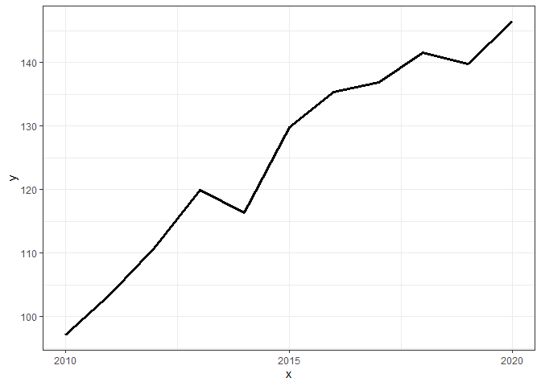
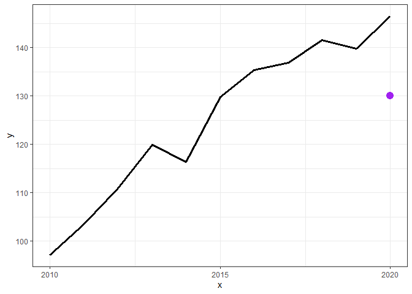
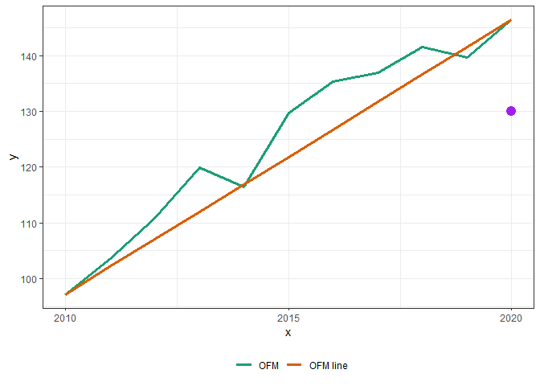
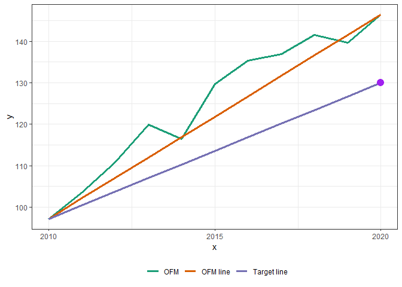
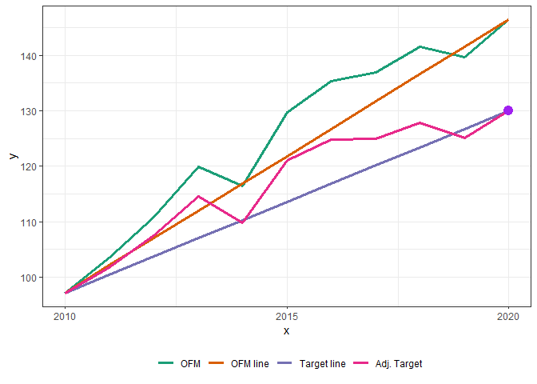

Backcasting Frankenpop
================

-   <a href="#backcasting-frankenpop"
    id="toc-backcasting-frankenpop">Backcasting Frankenpop</a>
-   <a href="#identify-ofm-sade-time-trend"
    id="toc-identify-ofm-sade-time-trend">1: Identify OFM SADE time
    trend:</a>
-   <a href="#frankenpop-target-for-2020"
    id="toc-frankenpop-target-for-2020">2: Frankenpop target for 2020</a>
-   <a href="#calculate-slope-of-ofm-data"
    id="toc-calculate-slope-of-ofm-data">3: Calculate slope of OFM data</a>
-   <a href="#calculate-slope-of-target-line"
    id="toc-calculate-slope-of-target-line">4: Calculate slope of target
    line</a>
-   <a href="#calculate-relative-deviation-of-ofm-from-ofm-line"
    id="toc-calculate-relative-deviation-of-ofm-from-ofm-line">5: Calculate
    relative deviation of <code>OFM</code> from <code>OFM line</code></a>
-   <a href="#apply-the-ofm-ofm-line-deviation-to-the-target-line"
    id="toc-apply-the-ofm-ofm-line-deviation-to-the-target-line">6: Apply
    the OFM : OFM line deviation to the Target line</a>

## Backcasting Frankenpop

This document briefly summarizes the method used to create Frankenpop
estimates between 2011 and 2019. Backcasted results are created by
applying the relative deviation from a straight between OFM 2010 and OFM
2020 to a straight line between OFM 2010 and Frankenpop 2020. As such,
the relative year to year variation is captured while the known (Census)
end points are kept fixed.

The method was applied to state, county, and block level results with
top-down raking to ensure consistency between nested geographies.

The following sections explain/illustrate the method in greater detail.

## 1: Identify OFM SADE time trend:

OFM SADE estimates (based on Census 2010) for 2010 to 2020 were
extracted for the lowest level demographics for a given geographic
resolution. For example: County X race/eth X single year age X gender.
Below, a sample/example set of estimates is generated for a hypothetical
demographic group that has 100 people in 2010 and increases 5 people per
year (with a bit of variation per year added for good measure).

``` r
set.seed(1)
sade = 100 + 5 * (seq_along(2010:2020)-1) + runif(length(2010:2020), -6, 6)
start = data.frame(x = as.Date(paste0('01-01-', 2010:2020), '%m-%d-%Y'), 
                   y = sade,
                   type = 'OFM')

ggplot(start, aes(x = x, y = y)) + geom_line(size = 1.1) + 
  theme_bw() + theme(legend.position = 'bottom')
```



## 2: Frankenpop target for 2020

The method is mostly a re-calibration of the OFM estimates (see step 1)
such that it is fixed at the starting 2010 value and ends at a fixed
2020 frankenpop value, while preserving the relative between year
variation. In this case, the frankenpop target (e.g. the population via
frankenpop for the chosen demographic) is 130.

``` r
ggplot(start, aes(x = x, y = y)) + geom_line(size = 1.1) + theme_bw() + 
  geom_point(data = data.frame(x = as.Date('2020-01-01'), y = 130),
             color = 'purple', size = 4)
```



## 3: Calculate slope of OFM data

A straight line between the OFM 2010 estimate and the OFM 2020 estimate
is calculated so that it can then be used as a reference to compute
relative deviation.

``` r
rise = (start$y[which.max(start$x)] -  start$y[which.min(start$x)])
run = 2020 - 2010
slope = rise/run
ofmline = data.frame(x = start$x, type = 'OFM line')
ofmline$y = ((year(ofmline$x)-2010) * slope) + start$y[which.min(start$x)]
gdat = rbind(start, ofmline)
gdat$type = factor(gdat$type, c('OFM', 'OFM line'))
ggplot(gdat, aes(x = x, y = y, color = type)) + geom_line(size = 1.1) +
  theme_bw() + 
  geom_point(data = data.frame(x = as.Date('2020-01-01'), y = 130),
             color = 'purple', size = 4) +
  scale_color_brewer(type = 'qual', palette = 2, name = "") +
  theme(legend.position = 'bottom')
```



## 4: Calculate slope of target line

A straight line between OFM 2010 and Frankenpop 2020 is the base for the
backcasted projections. It is this line to which the relative deviations
from the line defined in step \#3 will be applied.

``` r
rise = 130 - start$y[which.min(start$x)]
run = 2020-2010
slope = rise/run
tline = data.frame(x = start$x, type = 'Target line')
tline$y = ((year(tline$x)-2010) * slope) + start$y[which.min(start$x)]
gdat = rbind(gdat, tline)
gdat$type = factor(gdat$type, c('OFM', 'OFM line', 'Target line'))
ggplot(gdat, aes(x = x, y = y, color = type)) + geom_line(size = 1.1) +
  theme_bw() + 
  geom_point(data = data.frame(x = as.Date('2020-01-01'), y = 130),
             color = 'purple', size = 4) +
  scale_color_brewer(type = 'qual', palette = 2, name = "") +
  theme(legend.position = 'bottom')
```



## 5: Calculate relative deviation of `OFM` from `OFM line`

This step computes how far the OFM numbers are from the line from step
\#3 which is a straight line between OFM 2010 and OFM 2020.

``` r
rdev = merge(start, ofmline, by = 'x', all.x = T)
# OFM/OFM line
rdev$reldev = rdev$y.x/rdev$y.y
rdev = rdev[, c('x', 'reldev')]
```

## 6: Apply the OFM : OFM line deviation to the Target line

The deviations from step \#5 are applied to the target line created
during step \#4 to create the “final” backcasted population estimates.

``` r
adjt = merge(tline, rdev, all.x = T, by = 'x')
adjt$y = adjt$y * adjt$reldev
adjt = adjt[, c('x','y')]
adjt$type = 'Adj. Target'
gdat = rbind(gdat, adjt)
gdat$type = factor(gdat$type, 
                   c('OFM', 'OFM line', 
                     'Target line', 'Adj. Target'))
ggplot(gdat, aes(x = x, y = y, color = type)) + geom_line(size = 1.1) +
  theme_bw() + 
  geom_point(data = data.frame(x = as.Date('2020-01-01'), y = 130),
             color = 'purple', size = 4) +
  scale_color_brewer(type = 'qual', palette = 2, name = "") +
  theme(legend.position = 'bottom')
```



The `Adj. Target` line is anchored by the 2010 OFM estimate and the 2020
Frankenpop estimate and is the end result of this method. In the full
implementation results are raked top down (e.g. county -\> state, block
to raked county) and there is sporadic borrowing of deviations from a
larger geography when its not reasonable to compute (e.g. is `Inf` or
`NaN`) at the given geographic level. This mostly occurs when Frankenpop
and OFM disagree about whether there is `>0` count for a given
demographic group.
